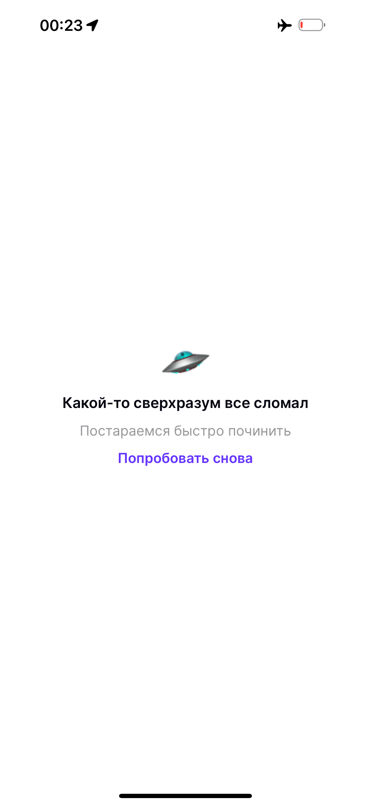

# Employee Directory App

## Описание проекта

Employee Directory App - это тестовое клиент-серверное приложение для отображения списка работников компании с возможностью сортировки и поиска. Приложение предоставляет следующие возможности:

- **Список работников**: Список представлен в виде таблицы, с отображением фотографии, имени и фамилии, а так же тега департамента.
- **Сортировка по департаментам**: Работники распределены по департаментам, список департаментов имеет удобное переключение в горизонтальной коллекции.
- **Поиск**: Поле для поиска по имени, фамилии или тегу. Используется поиск по точному совпадению.
- **Сортировка**: Работники сортируются по алфавиту или по дате рождения. При сортировке по дате рождения, список начинается с ближайшего дня рождения от текущей даты и далее.
- **Детальная информация**: Возможность просмотра детальной информации о каждом работнике с фотографией, расчетом текущего возраста и возможностью позвонить по номеру телефона.

## Технологии

Приложение написано для iOS с использованием нативных библиотек. Основные технологии и фреймворки, используемые для создания интерфейсов и функциональности, включают:

- **Swift**: Основной язык программирования для iOS.
- **UIKit**: Фреймворк для создания и управления пользовательскими интерфейсами.
- **UserDefaults**: Для локального хранения не конфиденциальных данных приложения.
- **URLSession**: Для выполнения сетевых запросов и получения данных из API.
- **JSONDecoder**: Для парсинга данных, полученных из API.
- **Auto Layout**: Для создания адаптивных интерфейсов.

## Скриншоты

  
  
  
 

## Установка

Для установки и запуска приложения следуйте следующим шагам:

1. Клонируйте репозиторий:
    ```bash
    git clone https://github.com/Vicodin78/EmployeeHub
    ```
2. Откройте проект в Xcode:
    ```bash
    cd KODEtest
    open KODEtest.xcodeproj
    ```
3. Запустите приложение на симуляторе или подключенном устройстве.

## Автор

* **Vicodin78** - [Профиль на GitHub](https://github.com/Vicodin78)

